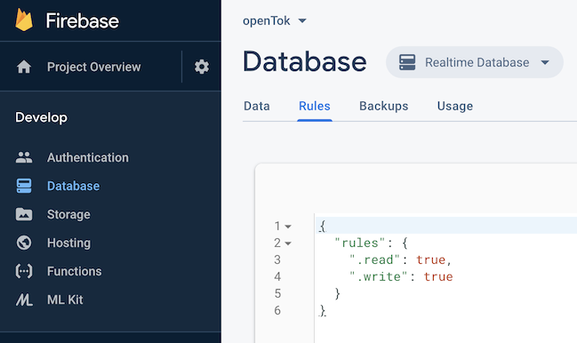
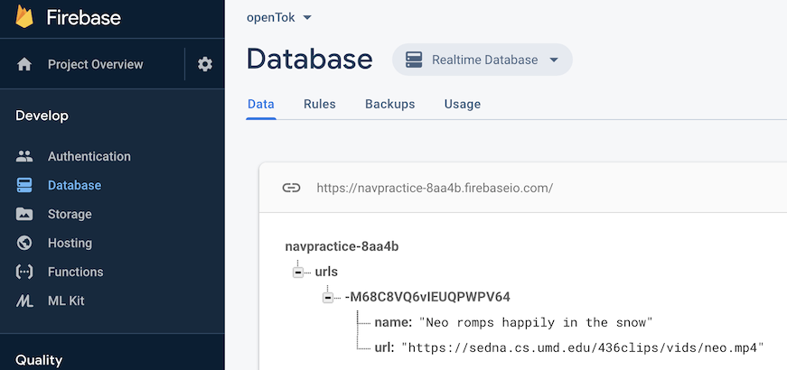
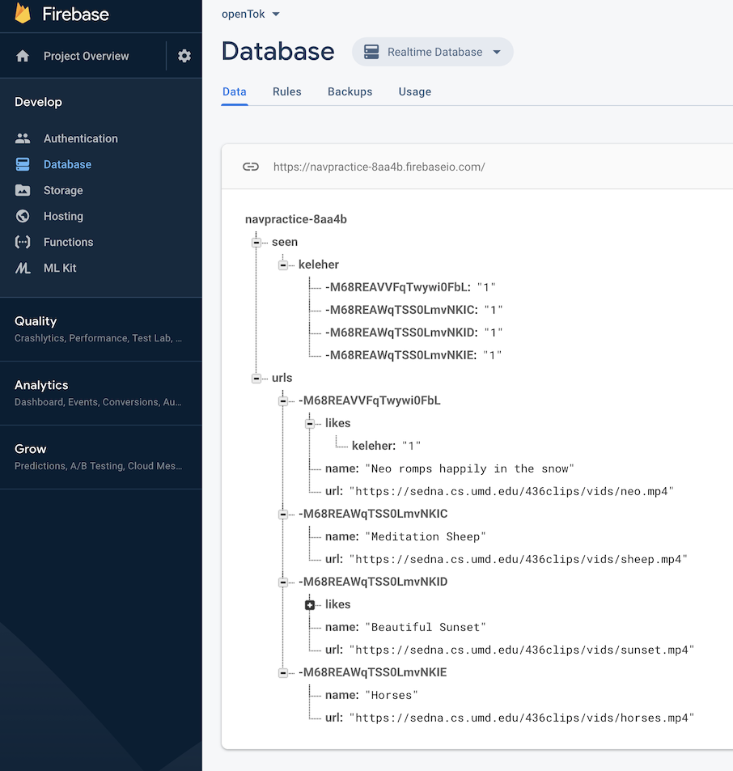

# Assignment 5: Tok: Firebase and Playing Video

## Goals
- learn to use external database, storage
- AVKit

## Approach

In this project we are going to build a pared-down version of
TikTok. You are going to build an app that allows you to upload
URLs of online videos to a database, play those videos, and "like"
your favorites. 

We will be using the Firebase Realtime Database to store the URLs,
"likes", and viewing information.

Quick demo available on Canvas

## Steps
There are many steps to this project; I encourage you to start early.

### Step 1: Set Up Your Database and Create Your App
In this step we are going to set up an iOS app and tie it into the
database. 

- Create a brand new app called `assign5` in your repository. 
  - no tests
  - bundle id **must be** `edu.maryland.cmsc436.spring2021.openTok`,
    though we will possibly change this later.
- Go to [http://firebase.google.com/](http://firebase.google.com/) and
register for the free Spark Plan.
  - Work through the [this
  guide](https://firebase.google.com/docs/ios/setup?authuser=0) to
  setting up a project. 
  - Name your Firebase project `assign5` as well, create a realtime database, and do not forget to download `GoogleService-Info.plist`
  - Your `Podfile` should consist of the following:
```
# Uncomment the next line to define a global platform for your project
# platform :ios, '9.0'

target 'openTok' do
  # Comment the next line if you don't want to use dynamic frameworks
  use_frameworks!

  # Pods for openTok
  pod 'Firebase/Database'
end
```

***Important***, to add the firebase configure code to our app, you may find that you do not have a file named  `AppDelegate.swift`, instead, you should modify your `assign5App.swift` as:
```
import SwiftUI
import Firebase

@main
struct assign5_testApp: App {
    var body: some Scene {
        WindowGroup {
            ContentView()
        }
    }
    
    func application(_ application: UIApplication,
                     didFinishLaunchingWithOptions launchOptions:
        [UIApplication.LaunchOptionsKey: Any]?) -> Bool {
        FirebaseApp.configure()
        return true
    }
}
```


  - You do not need to know much about
    [Cocoapods](https://cocoapods.org/). Create the above
    Podfile in your top `assign5` directory. Install Cocoapods on your machine if you don't already
    have it. Easiest is to use `sudo gem install cocoapods`, but if
    you don't have root access look [here](https://guides.cocoapods.org/using/getting-started.html)
		under "Sudo-less Installation". Then type `pod install` on the command line inside your top `assign5` directory.
		From then on, **always open assign5.xcworkspace** instead of "assign5.xcodeproj".


Try out your database!  Go to [https://console.firebase.google.com](https://console.firebase.google.com/u/0/), create the realtime database if you haven't already, and then click on 'Realtime Database'. Click on rules:

 

Set up both read and write rules as true.

Now go to the data tab. Real-time means that as you insert data from your app, it will magically appear in the browser window (see the demo for an example). Assuming you have correctly set up cocoapods, and the `GoogleService-Info.plist`. In your ContentView.swift, you should be able to try the following code: 
```
struct ContentView: View {
    
    func upload() {
        FirebaseApp.configure()
        let root = Database.database().reference()
        root.child("urls").childByAutoId().setValue(["name": "Neo romps happily in the snow", "url": "https://sedna.cs.umd.edu/436clips/vids/neo.mp4"])
    }
    
    var body: some View {
        Button(action: upload) {"Upload"}
    }
}
 ```
You should see the following on  your firebase console. Remember to import `Firebase` and `FirebaseDatabase` on top of your file:




## Step 2: Lay Out Your View

You should end up with at least two additional View files, named as `UploadView.swift` and `PlayerView.swift` (You may name them as you want and create more files if needed). You should create a `TabView` in your ContentView, including there two views.

## Step 3: Build the URL Uploader View 
This view controller will just allow the user to input a URL and description (through `TextField`s) and insert into
the database. A url and description can be inserted to firebase as follows:
```
root.child("urls").childByAutoId().setValue(["name": "Meditation Sheep", 
                                             "url": "https://sedna.cs.umd.edu/436clips/vids/sheep.mp4"])
```
Use of the `childByAutoID()` guarantees a unique key, even with simultaneous insertions
into the database.

Use an "Upload" button or to affirmatively trigger the database insertion.

Note that you can edit and delete data in the database from the console browser
window. Hover the mouse to the right of data and you will see options.


## Step 4: Create a Video Player
There are many ways to go here. You could, in fact, draw out an `AVKit Player View
Controller`, but it does not give you many options to customize. Note that aside from just
playing the videos, we want to display text over the video (the description, number of
likes), a button ("like"), and a gesture recognizer (or two). These are not easily built
on top of the default approach, but be my guest and try.

A slightly easier approach is to use a  `VideoPlayer`. Using this approach can be as simple as:
```
VideoPlayer(player: AVPlayer(url: "..."))
```

What else do we need to do?
- Attach labels for URL description and the number of likes, a "Like" button (use
  unicode emoji symbols), and a tap/swipe recognizer for going to the next video all to
  the view controller's view. You will need to do this programmatically.
- read the URL and Like information from the database.
- write Like annotations back to the database
- prev and next button to switch the videos to the previous or the next one. You should also implement left and right swipe gesture to perform same as prev and next button.


### Step 4a: Reading Data from the Database (high level)
Read the URLs from the database by creating an observer ([firebase
docs](https://firebase.google.com/docs/database/ios/read-and-write?authuser=0)) for the
path "root/urls" (w/ type `.value`). This observer is triggered every time data changes,
and happens asynchronously with respect to your app. The [snapshot](https://firebase.google.com/docs/reference/swift/firebasedatabase/api/reference/Classes/DataSnapshot) you get from this is not easy to parse, see the Firebase docs for complete information.
You should also imlement a button by clicking which you should be able to download a snapshot of the data. 

The firebase upload / download is asynchronized. When you start your app, you may see no video or see the inital video hardcoded set by you since the view is rendered before app fetch the data from firebase.

The following is a snapshot of the database showing four URLS, two likes (only one opened), and also
"Seen" information:



"Seen" information is just keeping track of which videos you have seen. This is a binary value, seen or never seen. You will use this
information to inform your video sorting heuristic to prefer fresh new videos over those
you have seen before.


### Step 4b: Writing To The Database
In addition to writing new URLs to the database as discussed above, you also need to add
"like" and "seen" information. 

Add the "like" information under "urls/<id>/likes/<dirID>", where "<id>" is the id of the
url, and "<dirid> is your directoryid. The value does not matter.

Add the "seen" information under "seen/<dirID>". 

### Step 4c: Build Your Sorting Heuristic
When your app goes live you want people to see videos that others have liked (high "like"
count), but also fresh new videos (not in your "seen" data). Given a set of URLs pulled
from the database, your sorting algorith should put all unseen videos first (order among
them does not matter), and then sort the rest according to descending number of likes.

Through this approach you build a video "playlist".

However, your URL observer is always running, and may be triggered asynchronously because of new
URLs or "likes" from other users. When to rebuild the playlist?  There are many ways to go
here, but these are my rules of thumb:
- Only rebuild the playlist if new URLs arrive, do not rebuild the playlist because of
  likes from other users. 
- Rebuild the playlist when you come to its end to incorporate updated "like" info.
- Do not change the first element in the playlist when rebuilding based on new URL's. Your
  current video should not change.

With this scheme you can never have more than one like per
video, as you only have one directory ID. However, the last stage of this project is going
live on the same database as everyone else.

## Step 5: Going Live on a Shared Database (This step will be updated later)
After getting your code running on your own database, you can try running it against our
shared database (which is where we will test it). 

**Please note:** There are no permissions, and any one of you can blow away or mess up the
entire database. Please be very careful when you start using this live database so as not
to annoy all the other users. 

**Please also note:** Uploading any inappropriate URLs will be reported to the proper
university officials. There are 150 students in the class, from every conceivable
background. This is not the place have fun with NSFW videos, or to argue your political
stance. Please report any violations to me; I can track who inserted what into the DB.

Steps:
- Ensure that you are using your directory ID for both the "likes" and "seen".
- Replace your `GoogleService-Info.plist` with the following one:
  [GoogleService-Info.plist](GoogleService-Info.plist).
- Replace your bundleID with `edu.maryland.cmsc436.spring2020.openTok.<dirid>`. This will
  no longer match the bundleID expected by the DB, but in its current permissive mode data
  will still be accessible.

## Running on your phone (we will not test)
Need to make sure your phone trusts the developer. When attempting to run on your phone, you may receive
a "signature not trusted by phone" or some such (this is not the exact wording). When this
happens you can go into Settings / General / Devide Management and explicitly trust your
developer signature.

Secondly, you may want to explicitly enable the app to use wireless data (though
this might burn through your data plan quickly).


  
## Grading
You should have uploaded at least 4 videos to your database before we test your app, with arbitrary value of likes and seen
- 30 pts: general structure, w/ distinct view controllers for the player,
  and the URL uploader. 
- 20 pts: URL uploading, downloadable and playable for player 
- 10 pts: showing name/description and number of "likes" over the top of the video
- 10 pts: ordering the URLs as above (unseen first, descending order of links otherwise)
- 10 pts: gesture recognizers
- 10 pts: implementing the "likes" button and functionality
- 10 pts: general look and feel


## Bonus Points
You may do at most one of these two bonus tasks. Each 15 pts, redeemable on final.
- Record and upload video from inside the app. You can upload anywhere you have access,
  though I suggest using Firebase Storage. 
- Resize or otherwise modify existing video in your app.

